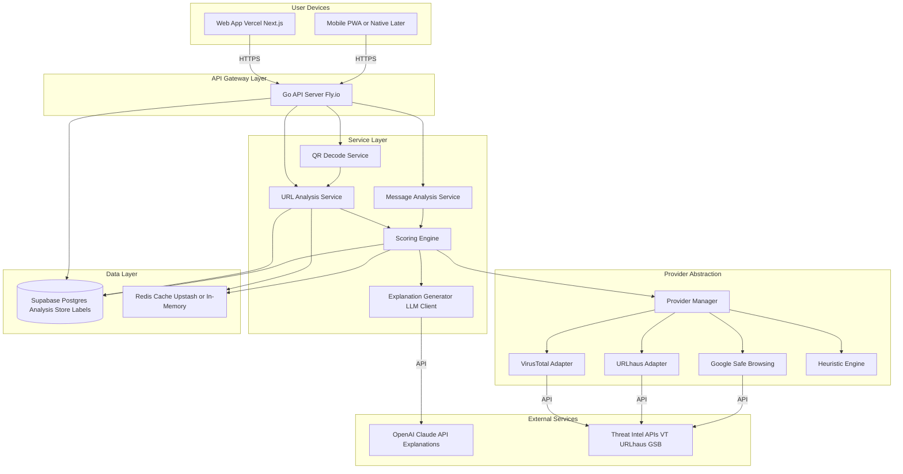
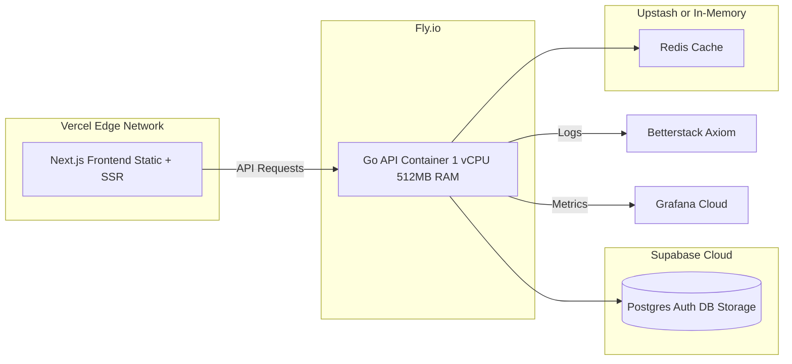

# Shield AI Security — Architecture Requirements Document (ARD)

**Version:** Consolidated 1.0
**Date:** 2026-02-14
**Status:** Ready for Implementation
**PRD Source:** [PRD/index_PRD.md](../PRD/index_PRD.md) v3.0 (2026-02-12)

---

## 1. Executive Summary

### 1.1 Problem (Jobs-to-be-Done)

When I receive a suspicious link, message, or image, I want to quickly understand if it is a scam and what to do, so I do not lose money or expose my data — without needing to be an expert.

### 1.2 Solution

Shield AI Security analyzes **URLs, messages, and visual evidence (Premium)** and returns a comprehensible verdict with signals and practical recommendations. The system prioritizes **explanation** and **user safety**, with **graceful degradation** (UNCERTAIN) when confidence is insufficient.

### 1.3 Architecture Style

**Modular Monolith in Go** — A single Go application with clear internal package boundaries, designed for cost control, simplicity, and security-first persistence. The architecture uses:

- **Supabase** for auth, Postgres DB, and storage
- **Fly.io** (or Railway) for the Go API
- **Vercel** for the frontend (Next.js/React)
- **Redis** (Upstash or in-memory) for operational cache

### 1.4 Key Constraints

| Constraint | Value | Source |
|------------|-------|--------|
| Budget | ≤$500/month | PRD §1.3 |
| TTFV | p50 ≤ 10s, p95 ≤ 25s | PRD §7.2 |
| Availability | 99.5% monthly | PRD §7.3 |
| Cache TTL | 48h | PRD §8.2 |
| Rate limits | 10 req/min, 60 req/h per IP | PRD §7.5 |
| Secrets | Vault mandatory (not env vars only) | PRD §7.4 |
| Verdict classes | HIGH RISK, LOW RISK, UNCERTAIN | PRD §4.1 |

---

## 2. PRD Traceability

| PRD Section | PRD Item | ARD Requirement IDs | Notes |
|-------------|----------|---------------------|-------|
| §1.3 | Success Metrics: TTFV p50 ≤ 10s, p95 ≤ 25s | ARD-NFR-001, ARD-NFR-002, AAC-001 | Core performance |
| §1.3 | Ops/Cost: Persist analyses for reuse | ARD-NFR-018, ARD-NFR-019, ARD-FUNC-001 | Analysis Store |
| §1.3 | Anti-abuse via rate limits | ARD-NFR-015, ARD-NFR-016, ARD-NFR-017 | Rate limiting |
| §1.3 | Quality: FP/FN via labeling | ARD-NFR-022, ARD-NFR-023, ARD-NFR-024 | Ground truth |
| §2.1 | Principles: Trust, Privacy, Degradation | ARD-CNST-001–005 | Architectural principles |
| §2.2 | Tiers: Free unlimited, Premium QR/OCR | ARD-NFR-034, ARD-FUNC-004, ARD-FUNC-005 | Feature gating |
| §2.3 | Access: No login, Contact CTA | ARD-CNST-001, ARD-NFR-035 | Anonymous Free tier |
| §4.2 | UNCERTAIN guardrail | ARD-CNST-003, ARD-NFR-006 | Graceful degradation |
| §4.3 | Two independent signals rule | ARD-NFR-032 | HIGH RISK logic |
| §5 | Risk Signals v0 | ARD-NFR-024, ARD-NFR-032 | Signal versioning |
| §6.1 | URL Check (Free) | ARD-FUNC-001, ARD-NFR-029, ARD-NFR-030 | Core feature |
| §6.2 | Message Checklist (Free) | ARD-FUNC-002, ARD-NFR-033 | Dual granularity |
| §6.3 | Shareable Verdict (Free) | ARD-FUNC-003, ARD-NFR-012 | Privacy-safe share card |
| §6.4 | QR Scan (Premium) | ARD-FUNC-004, ARD-NFR-034 | Premium feature |
| §6.5 | OCR/Vision (Premium) | ARD-FUNC-005, ARD-NFR-011, ARD-NFR-034 | Premium, no image storage |
| §7.1 | URL Normalization rules | ARD-NFR-029, AAC-010 | Deterministic normalization |
| §7.2 | Performance: TTFV, timeouts | ARD-NFR-001, ARD-NFR-004 | Performance budgets |
| §7.3 | Reliability: 99.5% SLO, degradation | ARD-NFR-005, ARD-NFR-006, ARD-NFR-007 | Availability |
| §7.4 | Security: Vault, kill switch, no PII in logs | ARD-NFR-009, ARD-NFR-010, ARD-NFR-008 | Security controls |
| §7.5 | Anti-abuse: Rate limits, bot detection | ARD-NFR-015, ARD-NFR-016, ARD-NFR-017 | Abuse prevention |
| §8.1 | Storage: No raw text/images/URLs | ARD-CNST-004, ARD-NFR-011, ARD-NFR-021 | Data minimization |
| §8.2 | Cache 48h, Analysis Store no expiration | ADR-Cache-Store, ARD-NFR-018, ARD-NFR-019 | Cache + Store |
| §8.3 | Retention: 30 days telemetry | ARD-NFR-020 | Log retention |
| §8.4 | LGPD: Delete <24h | ARD-CNST-005, ARD-NFR-013 | User rights |
| §9 | Ground truth: 3 reviewers, 2/3 quorum | ARD-NFR-022, ARD-NFR-023 | Quality pipeline |
| §10 | Observability: Events taxonomy | ARD-NFR-026, ARD-NFR-027 | Analytics + logs |
| §11 | Risks: FN, abuse, PII, provider costs | §11 Risks table | Risk mitigation |

---

## 3. Scope and Boundaries

### 3.1 In-Scope (MVP)

- **URL Check (Free):** Analyze pasted/shared URLs
- **Message Checklist (Free):** Analyze text with dual granularity (message + extracted URLs)
- **Shareable Verdict (Free):** Privacy-safe text card for messaging apps
- **Premium features:** QR Scan, OCR/Vision Screenshot Analysis
- **Paywall + Web Checkout:** Stripe or AbacatePay
- **Analysis Store:** DB persistence for reuse, no expiration
- **Internal ground truth labeling pipeline:** 3 reviewers, 2/3 quorum
- **LGPD:** Delete-on-request <24h with auditable record

### 3.2 Out-of-Scope (Post-MVP)

- User-visible analysis history
- **End-user feedback** (to avoid dataset contamination)
- Automated LGPD export report
- Browser extensions / deep integrations
- Proactive alerts

**Source:** PRD §6.6, §12

### 3.3 System Boundaries

| Boundary | Shield Owns | Third Parties |
|----------|-------------|---------------|
| Analysis pipeline | URL normalization, scoring, heuristics, orchestration | URL reputation providers, OCR, Vision APIs |
| Data | Analysis Store, labels, telemetry | Supabase (hosted), log aggregator |
| Auth | Session validation | Supabase Auth |
| Payment | Paywall enforcement, subscription validation | Stripe, AbacatePay |
| Frontend | Web app, forms, verdict display | Vercel (hosting) |

---

## 4. Architecture Overview

### 4.1 Component Diagram



### 4.2 Component Responsibilities

**Frontend (Vercel + Next.js/React)**
- User authentication (Supabase Auth client)
- Input forms (paste URL, scan QR, paste message)
- Verdict display (risk score, explanation, actions)
- Shareable verdict card generation
- Contact CTA (non-blocking)
- Responsive design (mobile-first)

**API Server (Go on Fly.io)**
- HTTP routing (chi/gin/fiber)
- Request validation and sanitization
- Rate limiting (10 req/min, 60 req/h per IP)
- Authentication middleware (Supabase JWT validation)
- Service orchestration
- Structured logging and metrics

**URL Analysis Service**
- Extract URL from input (handle obfuscation)
- Resolve redirects (safely, sandboxed, limit N=5)
- Trigger provider checks
- Coordinate with Cache and Analysis Store

**Scoring Engine**
- Weighted ensemble of provider signals
- Confidence calculation
- Verdict determination: **HIGH RISK**, **LOW RISK**, **UNCERTAIN**
- Two independent signals rule

**Provider Manager**
- Fallback chain orchestration
- Timeout management (3s per provider, 25s total)
- Circuit breaker (fail fast if provider consistently down)

**Operational Cache**
- L1 in-memory L2 Redis
- TTL: **48h**
- Key: `hash(normalized_url)`
- Singleflight pattern for concurrent requests

**Analysis Store (Supabase Postgres)**
- Persistent storage, **no expiration**
- Tables: `analysis_store`, `labels`, `api_usage`
- Row-Level Security (RLS) for admin data

### 4.3 Deployment Architecture



### 4.4 Migration Triggers (Metric-Driven)

| Component | Extraction Trigger | Remain in Monolith |
|-----------|-------------------|---------------------|
| Provider Layer | Cost > $300/month OR p95 > 20s sustained | Scoring, Cache, Handlers |
| OCR | CPU > 60% sustained OR >100 req/min | — |
| Billing | MRR > $10k OR compliance pressure | — |

**Principle:** Migrate by measurable pain, not by architectural trend.

---

## 5. NFRs with Measurable Targets

### 5.1 Performance

| ID | Statement | Metric/Target | Validation |
|----|-----------|---------------|------------|
| **ARD-NFR-001** | TTFV within budget | p50 ≤ 10s, p95 ≤ 25s, p99 ≤ 30s | Load testing; APM |
| **ARD-NFR-002** | Redirect resolution | p95 ≤ 4s, hard timeout 6s | Benchmarking |
| **ARD-NFR-003** | Analysis Store lookup | p95 ≤ 200ms | DB query testing |
| **ARD-NFR-004** | Provider timeouts | 3s per URL provider; 5s OCR/Vision; 25s total | Circuit breaker; telemetry |

### 5.2 Availability and Reliability

| ID | Statement | Metric/Target | Validation |
|----|-----------|---------------|------------|
| **ARD-NFR-005** | Service availability | 99.5% monthly | Health check; uptime monitoring |
| **ARD-NFR-006** | Graceful degradation | UNCERTAIN when timeout/failure/conflict; >50% UNCERTAIN during outage | Chaos testing |
| **ARD-NFR-007** | Provider fallback | >80% when primary fails | Integration tests |
| **ARD-NFR-008** | Kill switch | Global + per-provider; activation <30s | Ops runbook |

### 5.3 Security and Privacy

| ID | Statement | Metric/Target | Validation |
|----|-----------|---------------|------------|
| **ARD-NFR-009** | Secrets management | 100% in vault; zero in env/code | Security checklist; secret scanning |
| **ARD-NFR-010** | PII in logs | Zero PII; automated redaction | Log audit |
| **ARD-NFR-011** | Data minimization | No raw message, full URL, images | DB schema; code review |
| **ARD-NFR-012** | Share card privacy | Domain only; PII masked; 2–4 evidence bullets | Unit tests |
| **ARD-NFR-013** | LGPD delete | <24h; auditable record | E2E deletion test |
| **ARD-NFR-014** | TLS | All external TLS 1.2+ | SSL Labs scan |

### 5.4 Anti-Abuse & Rate Limiting

| ID | Statement | Metric/Target | Validation |
|----|-----------|---------------|------------|
| **ARD-NFR-015** | Rate limiting | 10 req/min (burst 20), 60 req/h per IP | Load testing; telemetry |
| **ARD-NFR-016** | Bot detection | Block >80% obvious bots; <1% FP | Honeypot; telemetry |
| **ARD-NFR-017** | No daily quotas | Zero daily quota in Free | Code review |

### 5.5 Data Storage & Retention

| ID | Statement | Metric/Target | Validation |
|----|-----------|---------------|------------|
| **ARD-NFR-018** | Analysis Store persistence | 100% analyses stored; store hit >30% after 1 month | DB write; telemetry |
| **ARD-NFR-019** | Analysis Store no expiration | Zero automatic deletions | Schema verification |
| **ARD-NFR-020** | Telemetry retention | 30 days | Cleanup job; audit |
| **ARD-NFR-021** | Data schema | hash, signals, evidence, verdict_class, timestamps | Migration tests |

### 5.6 Functional Requirements (Summary)

| ID | Feature | Key Acceptance Criteria |
|----|---------|-------------------------|
| **ARD-FUNC-001** | URL Check | Normalize deterministically; store hit returns cached; miss executes pipeline; verdict includes url_risk_pct, class, evidence (min 2 for HIGH); >25s → UNCERTAIN |
| **ARD-FUNC-002** | Message Checklist | Extract signals (no raw text); extract URLs; return message_risk_pct + url_risk_pct per link; separate message vs URL evidence |
| **ARD-FUNC-003** | Shareable Verdict | Domain only; date/time; verdict; 2–4 evidence bullets; PII masked; share event emitted |
| **ARD-FUNC-004** | QR Scan (Premium) | Resolve destination; normalize; run URL pipeline; paywall for Free |
| **ARD-FUNC-005** | OCR/Vision (Premium) | Do not persist image; combine textual + visual evidence; paywall for Free |

### 5.7 SLI/SLO Table

| SLI | SLO Target | Measurement | Alert Threshold |
|-----|------------|-------------|-----------------|
| Availability (Verdict API) | 99.5% monthly | Health check (1-min) | 5-min downtime |
| TTFV (p50) | ≤ 10s | APM latency | p50 >12s for 10 min |
| TTFV (p95) | ≤ 25s | APM latency | p95 >30s for 10 min |
| Error Rate | <2% | 5xx / total | >5% for 5 min |
| UNCERTAIN Rate | <10% (normal) | Verdict distribution | >20% for 15 min |
| Store Hit Ratio | >30% after 1 month | Store hits / total | <20% for 24h |

---

## 6. Data Model and Storage

### 6.1 Cache vs Store (Critical Distinction)

| Layer | Purpose | TTL | Key | Invalidation |
|-------|---------|-----|-----|--------------|
| **Operational Cache** | Latency + cost; fast lookup | **48h** | `hash(normalized_url)` | TTL; manual purge |
| **Analysis Store** | Persistent reuse; no expiration | None | `url_hash` (unique) | Manual purge only |

**Cache ≠ Store.** Do not mix retention policies.

### 6.2 Analysis Store Schema

```sql
CREATE TABLE analysis_store (
  id UUID PRIMARY KEY DEFAULT gen_random_uuid(),
  url_hash TEXT NOT NULL UNIQUE,
  domain TEXT NOT NULL,
  verdict_class TEXT NOT NULL CHECK (verdict_class IN ('HIGH_RISK', 'LOW_RISK', 'UNCERTAIN')),
  risk_score INTEGER CHECK (risk_score BETWEEN 0 AND 100),
  confidence TEXT,
  evidence JSONB,
  signals JSONB,
  scoring_version TEXT,
  provider_status JSONB,
  check_type TEXT DEFAULT 'url',
  created_at TIMESTAMPTZ DEFAULT NOW(),
  updated_at TIMESTAMPTZ DEFAULT NOW()
);

CREATE INDEX idx_analysis_store_url_hash ON analysis_store(url_hash);
CREATE INDEX idx_analysis_store_domain ON analysis_store(domain);
CREATE INDEX idx_analysis_store_created ON analysis_store(created_at DESC);
CREATE INDEX idx_analysis_store_verdict ON analysis_store(verdict_class);
```

### 6.3 Labels Table (Ground Truth)

```sql
CREATE TABLE labels (
  id UUID PRIMARY KEY DEFAULT gen_random_uuid(),
  check_id UUID REFERENCES analysis_store(id),
  final_label TEXT NOT NULL,
  votes INTEGER,
  decision_reason TEXT,
  created_at TIMESTAMPTZ DEFAULT NOW()
);
```

### 6.4 Data Classification

| Data Type | Store? | Retention |
|-----------|--------|-----------|
| url_hash, domain | Yes | No expiration |
| signals, evidence, verdict | Yes | No expiration |
| Raw message text | **No** | — |
| Full URL in cleartext | **No** | — |
| Images/screenshots | **No** | — |
| Telemetry logs | Yes (aggregator) | 30 days |
| Cost tracking | Yes | 90 days |

### 6.5 Idempotency

- **Singleflight** pattern by `url_hash`: concurrent requests for same URL → one provider call; others wait for result.
- **Optional:** `Idempotency-Key` header on `POST /check/*` with 5-min cache for duplicate submissions.

---

## 7. Security and Threat Model

### 7.1 Threat Model (T1–T8)

| ID | Threat | Mitigation |
|----|--------|------------|
| **T1** | Malicious input (XSS, SQLi, injection) | Input validation; parameterized queries; no eval/exec |
| **T2** | SSRF (internal URL scan) | Allowlist http/https; block private IPs (RFC 1918); redirect limit 5 |
| **T3** | Cache poisoning | Hash-based cache keys; manual purge; 48h TTL |
| **T4** | API abuse (DDoS, cost attack) | Rate limiting (10/min, 60/h); WAF (Cloudflare); bot detection |
| **T5** | Phishing via Shield (social engineering) | Clear messaging: "Shield is a tool, not a guarantee" |
| **T6** | PII leakage | Hash URLs; minimal logging; anonymize; share card masking |
| **T7** | Provider API key theft | Secrets in vault; rotate on compromise; never log |
| **T8** | MITM | TLS 1.3; HSTS; certificate pinning (future) |

### 7.2 Abuse Vectors

- **Scraping/bots:** Bulk URL analysis for reconnaissance; rate limits + bot detection
- **Injection:** Malformed URLs/messages; strict validation; whitelist
- **Auth/session:** Minimal for Free (anon); Premium via Supabase JWT

### 7.3 Controls

- **Rate limits:** 10 req/min, 60 req/h per IP (PRD §7.5)
- **SSRF:** Block private IPs; DNS validation; redirect limit 5
- **Secrets:** Vault mandatory (AWS Secrets Manager, HashiCorp Vault, GCP Secret Manager)
- **WAF:** Cloudflare free tier (DDoS, bot protection)
- **Audit logs:** User actions; security events; no PII

---

## 8. ADRs (Architecture Decision Records)

### ADR-001: Modular Monolith in Go

**Context:** Fast MVP with small team, tight budget, uncertainty about scaling.

**Decision:** Single Go application with clear package boundaries (`handler`, `service`, `provider`, `cache`, `storage`).

**Alternatives:** Microservices (rejected: ops overhead); Serverless (rejected: cold start vs <10s).

**Trade-offs:** Simpler deployment, lower cost; all components scale together.

---

### ADR-002: Provider Abstraction with Fallback Chain

**Context:** External APIs pose cost and reliability risks.

**Decision:** Provider interface with fallback: Primary → Secondary → Heuristics → UNCERTAIN.

**Alternatives:** Single provider (rejected: brittle); Parallel all (rejected: cost).

**Trade-offs:** Resilience, cost control; complex fallback logic.

---

### ADR-003: Aggressive Caching (48h TTL)

**Context:** API calls are primary cost driver.

**Decision:** Two-tier cache: L1 in-memory, L2 Redis. TTL **48h** (PRD-aligned).

**Alternatives:** No cache (rejected); DB-only (rejected: slower).

**Trade-offs:** 80–90% hit rate; stale results mitigated by 48h TTL.

**Cache Invalidation:** TTL expiration; manual purge endpoint. (No user feedback in MVP.)

---

### ADR-004: Weighted Ensemble Scoring (HIGH/LOW/UNCERTAIN)

**Context:** No ground truth for custom model; need interpretable logic.

**Decision:** Weighted scoring based on provider signals + heuristics. Verdict classes: **HIGH RISK**, **LOW RISK**, **UNCERTAIN** (PRD §4.1).

**Alternatives:** Single provider (rejected); Custom ML (rejected: no labels).

**Trade-offs:** Fast to implement; manual weight tuning.

---

### ADR-005: AI Explanation Generation via LLM

**Context:** Need plain-language explanations from technical signals.

**Decision:** OpenAI (gpt-4o-mini) or Claude Haiku for explanation synthesis.

**Alternatives:** Template-only (rejected: robotic); On-device (rejected: MVP complexity).

**Trade-offs:** High quality; ~$0.002/explanation; cache explanations.

---

### ADR-006: Supabase for Auth + DB + Storage

**Context:** Need managed auth, Postgres, object storage.

**Decision:** Supabase (free tier: auth, 500MB DB, 1GB storage).

**Alternatives:** AWS (rejected: cost); Firebase (rejected: less control).

**Trade-offs:** Fast setup; vendor lock-in mitigated by Postgres compatibility.

---

### ADR-007: Deployment on Fly.io + Vercel

**Context:** Cost-effective hosting.

**Decision:** Go API on Fly.io; Next.js on Vercel.

**Alternatives:** Pure Vercel (rejected: 10s timeout); AWS ECS (rejected: cost).

**Trade-offs:** ~$0–10/month hosting; Fly.io sleep on inactivity.

---

### ADR-008: Rate Limiting (PRD-Aligned)

**Context:** Abuse prevention + cost control.

**Decision:** 10 req/min (burst 20), 60 req/h per IP. No daily quotas in Free.

**Alternatives:** Stricter (rejected: blocks legitimate users).

**Trade-offs:** Prevents abuse; may frustrate power users (Premium roadmap).

---

### ADR-009: Observability on a Budget

**Context:** Logs, metrics, alerts without expensive platforms.

**Decision:** Structured JSON logs → Betterstack/Axiom; Prometheus → Grafana Cloud.

**Trade-offs:** Free/cheap; limited retention (7–14 days).

---

### ADR-010: No Custom Deepfake Detection in MVP

**Context:** Complex, expensive, uncertain ROI.

**Decision:** Deprioritize deepfake feature for MVP.

**Trade-offs:** Focus on core value; feature gap post-MVP.

---

### ADR-011: UNCERTAIN Verdict State

**Context:** Providers may fail or return conflicting signals.

**Decision:** When confidence low or providers fail → return **UNCERTAIN** with safest guidance.

**Trade-offs:** Builds trust; may frustrate users wanting definitive answers.

---

### ADR-012: Cache vs Store (Operational vs Persistent)

**Context:** Confusion between short-term cache and long-term persistence.

**Decision:** **Operational Cache** = 48h TTL, L1+L2, for latency/cost. **Analysis Store** = no expiration, Postgres, for reuse and ground truth.

**Trade-offs:** Clear separation; no automatic expiration of analysis data.

---

### ADR-013: No User Feedback in MVP

**Context:** PRD §6.6: "Feedback do usuário (para evitar contaminação do dataset)" — Post-MVP.

**Decision:** Do not implement end-user feedback (thumbs up/down, mark as scam/safe) in MVP. Quality via internal ground truth labeling only.

**Trade-offs:** Avoids dataset contamination; defers feedback loop to Beta/GA.

---

## 9. Dependencies and Vendors

| Provider Type | Examples | Purpose | Latency Budget | Fallback | Cost |
|---------------|----------|---------|----------------|----------|------|
| URL Reputation | VirusTotal, URLhaus, Google Safe Browsing, PhishTank | Malicious URL detection | 3s per call | Secondary → heuristics | $0–$0.02/check |
| OCR | Google Vision, AWS Textract, Azure OCR | Extract text from images | 5s | UNCERTAIN if fail | — |
| Vision | OpenAI GPT-4 Vision, Google Vision | Visual scam patterns | 5s | UNCERTAIN if fail | — |
| Payment | Stripe, AbacatePay | Subscription checkout | Not critical path | Manual failover | — |
| Auth | Supabase Auth | JWT validation | — | — | — |

### Provider Fallback Chain (URL Check)

1. Check Operational Cache → if hit (< 48h) → return
2. Check Analysis Store → if hit → return + cache
3. Primary Provider (e.g., VirusTotal) → if success → score + store + cache
4. Secondary Provider (URLhaus) → if success → score + store + cache
5. Tertiary Provider (Google Safe Browsing) → if success → score + store + cache
6. Heuristic Engine → always runs
7. If all fail → UNCERTAIN

### Circuit Breaker

- Fail threshold: 5 consecutive failures
- Cooldown: 60 seconds
- Half-open retry

---

## 10. Operations and Observability

### 10.1 Deployment

- **Environments:** local, staging, production
- **CI/CD:** GitHub Actions; lint, test, deploy; rollback support
- **Rollback:** Fly.io `fly releases rollback`; Vercel dashboard

### 10.2 Monitoring

- **Metrics:** Prometheus (request count, latency p50/p95/p99, provider success, cache hit rate, cost)
- **Logs:** Structured JSON; zerolog/zap; PII redaction
- **Alerts:** p95 >30s; error >5%; UNCERTAIN >20%; availability breach

### 10.3 Runbooks

**ARD-OPS-001: Incident Response**
- Symptom: Availability SLO breach
- Steps: Check health, logs, provider status, DB; escalate in 15 min

**ARD-OPS-002: Provider Outage**
- Symptom: UNCERTAIN rate >20% for 15 min
- Steps: Check provider status; activate kill switch; use fallback; status page

**ARD-OPS-003: LGPD Data Incident**
- Symptom: Suspected PII leakage
- Steps: Identify scope; redact/purge; notify DPO; document; fix

### 10.4 Disaster Recovery

- **RPO:** 24h (daily backup)
- **RTO:** 4h (restore from backup)
- **Daily backup:** Supabase; verify monthly

---

## 11. Cost Model

### 11.1 Budget Ceiling

**Target:** ≤$500/month (PRD §1.3)

### 11.2 Cost Breakdown (MVP)

| Item | Cost |
|------|------|
| Fly.io (Go API) | $0–10/month |
| Supabase | $0 (free tier) |
| Upstash Redis (or in-memory) | $0 |
| Vercel (Frontend) | $0 |
| Cloudflare (DNS + WAF) | $0 |
| VirusTotal API | $0 (free) or ~$20 (paid) |
| OpenAI API | ~$50/month (with caching) |
| Betterstack / Grafana | $0 |
| Buffer | ~$50 |
| **Total** | **~$80–130/month** |

### 11.3 Governance

- Monthly provider cap
- Real-time cost tracking
- Heuristic fallback mode when budget exceeded

---

## 12. Implementation Plan

### 12.1 Phases

**MVP1: Core URL Check (Weeks 1–6)**
- Provider adapters, scoring engine, cache (48h), Analysis Store
- API `POST /check/url`; frontend URL input form
- Rate limiting (10/min, 60/h); monitoring

**MVP2: QR + Message Analysis (Weeks 7–9)**
- QR decode; message analysis (regex + keywords)
- OpenAI explanation generation
- Frontend: QR scanner, message input

**MVP3: Polish + Beta (Weeks 10–12)**
- Shareable verdict cards; onboarding
- Feature flags; gradual rollout
- Paywall; checkout (Stripe/AbacatePay)

### 12.2 Critical Path

- Provider PoC (Week 2)
- OCR/Vision provider selection (Week 3)
- Load testing (Week 10)

### 12.3 Architecture Acceptance Criteria

| ID | Description | Validation | Owner |
|----|--------------|------------|-------|
| AAC-001 | TTFV p50 ≤ 10s, p95 ≤ 25s under 100 req/min | Load test | Eng |
| AAC-002 | Secrets in vault; no PII in logs; TLS | Security audit | Eng + Security |
| AAC-003 | No raw messages/images; share cards masked | DB audit + QA | QA + Legal |
| AAC-004 | Dashboards: TTFV, verdict distribution, store hit | Dashboard review | Eng + Ops |
| AAC-005 | Provider outage → UNCERTAIN >50%; no crash | Chaos test | Eng |
| AAC-006 | Rate limit 10 req/min per IP | Load test | Eng |
| AAC-007 | DR: backup restore, RTO <4h | DR drill | Ops |
| AAC-008 | Labeling: 150 samples in first week | Labeling tool | PM + QA |
| AAC-009 | Paywall: Free cannot access QR/OCR | Integration test | QA |
| AAC-010 | URL normalization: 100 test cases pass | Unit tests | Eng |

---

## 13. Verification and Testability

### 13.1 Unit Tests

- Scoring engine (signal combinations)
- URL normalization (50+ edge cases)
- Validation (malformed URLs, SSRF attempts)

### 13.2 Integration Tests

- Provider mocks; store hit/miss
- E2E: submit URL → get verdict

### 13.3 Load Tests

- 100 req/min sustained; p95 ≤ 25s
- Burst: 500 req/min for 5 min

### 13.4 Security Tests

- SSRF (private IPs blocked)
- Rate limit enforcement
- PII audit (logs, share cards)

### 13.5 Chaos Tests

- Provider failure → UNCERTAIN

---

## 14. Appendices

### Appendix A: Traceability Map (PRD → ARD)

See §2.

### Appendix B: Non-Goals / Out of Scope

1. User-visible analysis history
2. **End-user feedback** (thumbs up/down)
3. Automated LGPD export
4. Browser extensions
5. Proactive alerts
6. Multi-language (i18n) — Portuguese only for MVP
7. Microservice architecture
8. AI/LLM-based risk scoring (v0 rule-based)

### Appendix C: Glossary

- **TTFV:** Time to First Verdict
- **FP/FN:** False Positive / False Negative
- **UNCERTAIN:** Verdict when confidence insufficient
- **Feature Gating:** Monetization by unlocking Premium features
- **Analysis Store:** Persistent DB for reuse; no expiration
- **Operational Cache:** 48h TTL; L1+L2; latency/cost

### Appendix D: Assumptions

| ID | Assumption | Validation | Owner |
|----|------------|------------|-------|
| ARD-ASMP-001 | Brazilian Portuguese primary; i18n not MVP | User research | Product |
| ARD-ASMP-002 | Stripe and AbacatePay viable | Payment PoC | Engineering |
| ARD-ASMP-003 | Provider APIs meet latency budgets | Load testing | Engineering |
| ARD-ASMP-004 | 10 req/min sufficient anti-abuse | Telemetry | Ops |
| ARD-ASMP-005 | Analysis Store <100M checks/year | Cost modeling | Ops |

### Appendix E: Hard Constraints

- **ARD-CNST-001:** Free tier MUST NOT require login
- **ARD-CNST-002:** Secrets MUST be in vault
- **ARD-CNST-003:** System MUST return UNCERTAIN if total time >25s
- **ARD-CNST-004:** System MUST NOT store raw message, full URL, images
- **ARD-CNST-005:** Delete-on-request <24h with audit

---

**Document End**

**ARD Version History:**
- Consolidated 1.0 (2026-02-14): Merged from Main ARD, ARD v1, v2, v3; PRD-aligned; consistency fixes applied.
