# Shield AI — Backend Plan

## Overview

This document organizes all backend-related User Stories and Tasks for the Shield AI MVP. Work is phased to align with ARD package boundaries and API contract delivery.

## Phase Flow

```mermaid
flowchart TB
    subgraph Phase0 [Phase 0 - Foundation]
        US0000[US-0000 Architecture Setup]
    end
    subgraph Phase1 [Phase 1 - Core Pipeline]
        US0001[US-0001 URL Check]
        T0001[T-0001 URL Normalization Cache]
        T0002[T-0002 URL Analysis Pipeline]
    end
    subgraph Phase2 [Phase 2 - Message and Share]
        US0002[US-0002 Message Checklist]
        US0003[US-0003 Shareable Verdict]
        T0003[T-0003 Message Analysis]
    end
    subgraph Phase3 [Phase 3 - Premium and Infra]
        US0004[US-0004 QR Scan]
        US0005[US-0005 OCR Vision]
        US0006[US-0006 Paywall]
        US0011[US-0011 Infrastructure]
        T0005[T-0005 QR Decode BE]
        T0006[T-0006 OCR Vision Pipeline]
        T0007[T-0007 Checkout BE]
        T0013[T-0013 Rate Limiting]
        T0014[T-0014 Secrets Vault]
        T0015[T-0015 Observability]
        T0016[T-0016 Deployment]
    end
    subgraph Phase4 [Phase 4 - Supporting]
        US0007[US-0007 Contact CTA]
        US0009[US-0009 Settings]
        US0010[US-0010 Ground Truth]
        T0008[T-0008 Contact CTA BE]
        T0011[T-0011 Settings Delete BE]
        T0012[T-0012 Ground Truth Panel]
    end
    US0000 --> Phase1
    Phase1 --> Phase2
    Phase2 --> Phase3
    Phase3 --> Phase4
```

---

## Backend User Stories Index

| ID | Title | Plan Phase | Priority |
|----|-------|------------|----------|
| [US-0000](../user-stories/US-0000-architecture-setup.md) | Architecture Setup | Phase 0 | P0 |
| [US-0001](../user-stories/US-0001-url-check-free.md) | URL Check (Free) | Phase 1 | P0 |
| [US-0002](../user-stories/US-0002-message-checklist-free.md) | Message Checklist (Free) | Phase 2 | P0 |
| [US-0003](../user-stories/US-0003-shareable-verdict-free.md) | Shareable Verdict (Free) | Phase 2 | P0 |
| [US-0004](../user-stories/US-0004-qr-scan-premium.md) | QR Scan (Premium) | Phase 3 | P1 |
| [US-0005](../user-stories/US-0005-ocr-vision-premium.md) | OCR + Vision (Premium) | Phase 3 | P1 |
| [US-0006](../user-stories/US-0006-paywall-checkout.md) | Paywall + Checkout | Phase 3 | P1 |
| [US-0007](../user-stories/US-0007-contact-cta-capture.md) | Contact CTA Capture | Phase 4 | P1 |
| [US-0009](../user-stories/US-0009-settings-privacy-delete.md) | Settings + Privacy + Delete Data | Phase 4 | P1 |
| [US-0010](../user-stories/US-0010-ground-truth-labeling.md) | Ground Truth Labeling Pipeline | Phase 4 | P1 |
| [US-0011](../user-stories/US-0011-infrastructure-deployment.md) | Infrastructure + Deployment | Phase 3 | P0 |

---

## Backend Tasks

| Task | Description | Phase | Owner |
|------|-------------|-------|-------|
| [T-0000a](../tasks/T-0000a-go-scaffolding.md) | Go API Project Scaffolding | Phase 0 | BE |
| [T-0001](../tasks/T-0001-url-normalization-cache.md) | URL Normalization & Cache | Phase 1 | BE |
| [T-0002](../tasks/T-0002-url-analysis-pipeline.md) | URL Analysis Pipeline | Phase 1 | BE |
| [T-0003](../tasks/T-0003-message-analysis-service.md) | Message Analysis Service | Phase 2 | BE |
| [T-0005](../tasks/T-0005-qr-decode-paywall.md) | QR Decode & Paywall (BE part) | Phase 3 | BE |
| [T-0006](../tasks/T-0006-ocr-vision-pipeline.md) | OCR/Vision Pipeline | Phase 3 | BE |
| [T-0007](../tasks/T-0007-stripe-abacate-checkout.md) | Stripe/AbacatePay Checkout (BE part) | Phase 3 | BE |
| [T-0008](../tasks/T-0008-contact-cta-form.md) | Contact CTA Form (BE part) | Phase 4 | BE |
| [T-0011](../tasks/T-0011-settings-delete-data.md) | Settings & Delete Data (BE part) | Phase 4 | BE |
| [T-0012](../tasks/T-0012-ground-truth-panel.md) | Ground Truth Panel | Phase 4 | BE |
| [T-0013](../tasks/T-0013-rate-limiting-abuse.md) | Rate Limiting & Abuse | Phase 3 | BE/Infra |
| [T-0014](../tasks/T-0014-secrets-vault-logging.md) | Secrets, Vault & Logging | Phase 3 | BE/Sec |
| [T-0015](../tasks/T-0015-observability-events.md) | Observability & Events | Phase 3 | BE/Infra |
| [T-0016](../tasks/T-0016-deployment-cicd.md) | Deployment & CI/CD | Phase 3 | Infra |

---

## API Contract by Phase

| Phase | Endpoints | Request/Response |
|-------|-----------|------------------|
| Phase 0 | `GET /health` | Health status |
| Phase 1 | `POST /check/url` | Body: `{ "url": "..." }` → Verdict (url_risk_pct, verdict_class, evidence) |
| Phase 2 | `POST /check/message` | Body: `{ "message": "..." }` → message_risk_pct, url_risk_pct per link |
| Phase 3 | `POST /check/image` (OCR), subscription validation, checkout webhook | Image payload; subscription check |
| Phase 4 | `POST /contact`, `POST /privacy/delete-request` | Contact form; delete request |

---

## ARD References

| Package | Responsibility | ARD |
|---------|----------------|------|
| `handler` | HTTP routing, validation, sanitization | §4.2 |
| `service` | URL Analysis, Message Analysis, QR, OCR orchestration | §4.2 |
| `provider` | VirusTotal, URLhaus, GSB adapters; Provider Manager | §4.2 |
| `cache` | L1 in-memory, L2 Redis, 48h TTL | §4.2, ADR-003 |
| `storage` | Analysis Store, labels, Supabase | §4.2, §6 |

**NFRs:** ARD §5 (Performance, Availability, Security, Rate Limiting, Data Storage)

---

## Traceability

- **PRD:** [PRD/index_PRD.md](../PRD/index_PRD.md) v3.0
- **ARD:** [ARD/Shield_AI_Security_ARD_Consolidated.md](../ARD/Shield_AI_Security_ARD_Consolidated.md)
- **Frontend Plan:** [frontend-plan.md](frontend-plan.md)
