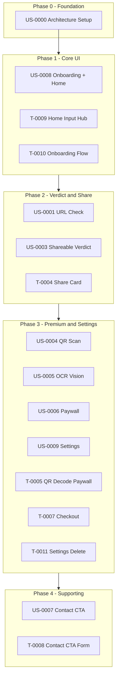

# Shield AI — Frontend Plan

## Overview

This document organizes all frontend-related User Stories and Tasks for the Shield AI MVP. Work is phased to align with backend API availability and Design Spec screens.

## Phase Flow

---

## Frontend User Stories Index

| ID | Title | Plan Phase | Priority |
|----|-------|------------|----------|
| [US-0000](../user-stories/US-0000-architecture-setup.md) | Architecture Setup | Phase 0 | P0 |
| [US-0001](../user-stories/US-0001-url-check-free.md) | URL Check (Free) | Phase 2 | P0 |
| [US-0003](../user-stories/US-0003-shareable-verdict-free.md) | Shareable Verdict (Free) | Phase 2 | P0 |
| [US-0004](../user-stories/US-0004-qr-scan-premium.md) | QR Scan (Premium) | Phase 3 | P1 |
| [US-0005](../user-stories/US-0005-ocr-vision-premium.md) | OCR + Vision (Premium) | Phase 3 | P1 |
| [US-0006](../user-stories/US-0006-paywall-checkout.md) | Paywall + Checkout | Phase 3 | P1 |
| [US-0007](../user-stories/US-0007-contact-cta-capture.md) | Contact CTA Capture | Phase 4 | P1 |
| [US-0008](../user-stories/US-0008-onboarding-home-input.md) | Onboarding + Home Input Hub | Phase 1 | P1 |
| [US-0009](../user-stories/US-0009-settings-privacy-delete.md) | Settings + Privacy + Delete Data | Phase 3 | P1 |

---

## Frontend Tasks

| Task | Description | Phase | Owner |
|------|-------------|-------|-------|
| [T-0000b](../tasks/T-0000b-nextjs-scaffolding.md) | Next.js App Scaffolding | Phase 0 | FE |
| [T-0004](../tasks/T-0004-share-card-generation.md) | Share Card Generation | Phase 2 | FE |
| [T-0005](../tasks/T-0005-qr-decode-paywall.md) | QR Decode & Paywall (FE part) | Phase 3 | FE |
| [T-0007](../tasks/T-0007-stripe-abacate-checkout.md) | Stripe/AbacatePay Checkout (FE part) | Phase 3 | FE |
| [T-0008](../tasks/T-0008-contact-cta-form.md) | Contact CTA Form (FE part) | Phase 4 | FE |
| [T-0009](../tasks/T-0009-home-input-hub-ui.md) | Home Input Hub UI | Phase 1 | FE |
| [T-0010](../tasks/T-0010-onboarding-flow.md) | Onboarding Flow | Phase 1 | FE |
| [T-0011](../tasks/T-0011-settings-delete-data.md) | Settings & Delete Data (FE part) | Phase 3 | FE |

---

## API Dependencies by Phase

| Phase | Required API Endpoints |
|-------|------------------------|
| Phase 1 | None (static UI) |
| Phase 2 | `POST /check/url`, verdict response schema |
| Phase 3 | `POST /check/url` (QR), `POST /check/image` (OCR), subscription validation, checkout redirect |
| Phase 4 | `POST /contact` |

---

## Design Spec References

| Screen | Design Spec Section | Tasks |
|--------|---------------------|-------|
| Onboarding (3 screens) | §5 Screen 1 | T-0010 |
| Home / Input Hub | §5 Screen 2 | T-0009 |
| Verdict / Results | §5 Screen 3 | T-0004 (share), URL Check UI |
| Settings | §5 Screen 6 | T-0011 |
| Paywall | §5 (Premium flows) | T-0005, T-0007 |

---

## Traceability

- **PRD:** [PRD/index_PRD.md](../PRD/index_PRD.md) v3.0
- **ARD:** [ARD/Shield_AI_Security_ARD_Consolidated.md](../ARD/Shield_AI_Security_ARD_Consolidated.md)
- **Design Spec:** [Design Spec/Shield_Ai_Security_Design_Spec.md](../Design%20Spec/Shield_Ai_Security_Design_Spec.md)
- **Backend Plan:** [backend-plan.md](backend-plan.md)
